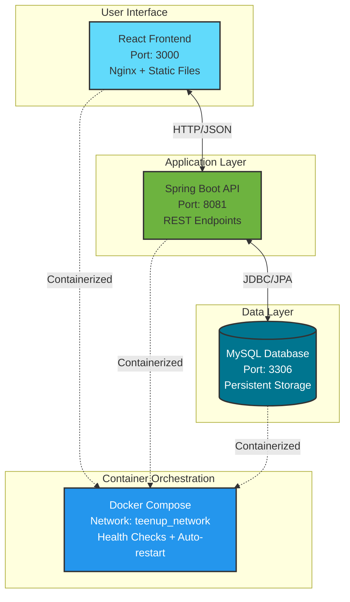

# 🎓 TeenUp Contest Management System

Hệ thống quản lý cuộc thi với **Spring Boot Backend** + **React Frontend** + **MySQL Database**.

## 🚀 **QUICK START - ONE COMMAND**

### **🌟 Universal Control Script (Recommended)**

**🐧 Linux/macOS/WSL:**
```bash
# Universal script - tự động nhận diện môi trường
./teenup.sh start     # Khởi động hệ thống
./teenup.sh stop      # Dừng hệ thống  
./teenup.sh health    # Kiểm tra sức khỏe
./teenup.sh status    # Xem trạng thái
./teenup.sh info      # Hiển thị thông tin

# Interactive mode
./teenup.sh
```

**🪟 Windows:**
```cmd
# Universal script - tự động nhận diện môi trường
teenup.bat start      # Khởi động hệ thống
teenup.bat stop       # Dừng hệ thống
teenup.bat health     # Kiểm tra sức khỏe
teenup.bat status     # Xem trạng thái
teenup.bat info       # Hiển thị thông tin

# Interactive mode  
teenup.bat
```

### **📋 Yêu cầu hệ thống:**
- **Docker & Docker Compose** - [Xem hướng dẫn cài đặt](docs/DOCKER.md)
- **Ports khả dụng:** 3000, 8081, 3306
- **File .env** - sẽ được tạo tự động từ `env.example`

### **🎯 Truy cập hệ thống:**
- 🌐 **Frontend:** http://localhost:3000
- 🔧 **Backend API:** http://localhost:8081/api (base path)
- 📋 **API Examples:** 
  - Parents: http://localhost:8081/api/parents/list
  - Students: http://localhost:8081/api/students/list  
  - Classes: http://localhost:8081/api/classes
- 🗄️ **Database:** localhost:3306

---

## 📚 **Documentation**

### **📖 Tài liệu chính:**
- 📋 **[Tổng quan kiến trúc](docs/ARCHITECTURE.md)** - System architecture overview
- 🐳 **[Docker setup](docs/DOCKER.md)** - Hướng dẫn cài đặt Docker
- 📝 **[Project specification](docs/project-spec.md)** - Chi tiết yêu cầu dự án

### **🔧 Backend documentation:**
- 🏗️ **[Backend Architecture](docs/backend/ARCHITECTURE.md)** - Backend architecture details
- 📡 **[API Endpoints](docs/backend/api-endpoints.md)** - REST API documentation
- 🎯 **[Business Logic](docs/backend/BUSINESS-LOGIC.md)** - Business rules & validation
- 🚀 **[Development Guide](docs/backend/DEVELOPMENT.md)** - Backend development setup

### **🌐 Frontend documentation:**
- 🏗️ **[Frontend Structure](docs/frontend/STRUCTURE.md)** - Component architecture
- 🔌 **[API Integration](docs/frontend/API-INTEGRATION.md)** - API client implementation
- 🚀 **[Development Setup](docs/frontend/DEVELOPMENT.md)** - Frontend development guide
- 📦 **[Setup Guide](docs/frontend/SETUP.md)** - Environment setup

---

## 🏗️ **System Architecture**



---

## 📊 **Auto Data Seeding**

Khi khởi động lần đầu, hệ thống tự động tạo dữ liệu mẫu:

### **👨‍👩‍👧‍👦 Parents (2):**
- **Nguyen Van A** - 📞 0901111111, 📧 a@example.com
- **Tran Thi B** - 📞 0902222222, 📧 b@example.com

### **👨‍🎓 Students (3):**
- **Minh** (Grade 7) - Parent: Nguyen Van A
- **Lan** (Grade 8) - Parent: Nguyen Van A  
- **Hoang** (Grade 6) - Parent: Tran Thi B

### **📚 Classes (3):**
- **Toán Nâng Cao** - Thứ 3, 14:00-15:30, Giáo viên: Cô Hoa
- **Tiếng Anh A2** - Thứ 5, 08:00-09:30, Giáo viên: Thầy Nam
- **Khoa học Vui** - Thứ 7, 09:00-10:30, Giáo viên: Cô Linh

### **🎁 Subscriptions:**
- **Basic-12** (Minh): 12 buổi học, 0 đã sử dụng
- **Basic-08** (Lan): 8 buổi học, 1 đã sử dụng

---

## 🛠️ **Advanced Usage**

### **📁 Script Organization:**
```
scripts/
├── docker-healthcheck.sh/bat     # Docker & port health check
├── start-native.sh/bat           # Native OS startup
├── start-linux-wsl.sh            # WSL startup (from Linux)
├── start-windows-wsl.bat         # WSL startup (from Windows)
├── stop-native.sh/bat            # Native OS shutdown
├── stop-linux-wsl.sh             # WSL shutdown (from Linux)
└── stop-windows-wsl.bat          # WSL shutdown (from Windows)
```

### **🔧 Manual Script Execution:**

**Linux/macOS Native:**
```bash
./scripts/start-native.sh         # Start system
./scripts/stop-native.sh          # Stop system
./scripts/docker-healthcheck.sh   # Health check
```

**Windows Native:**
```cmd
scripts\start-native.bat          # Start system
scripts\stop-native.bat           # Stop system  
scripts\docker-healthcheck.bat    # Health check
```

**WSL (from Linux):**
```bash
./scripts/start-linux-wsl.sh      # Start in WSL
./scripts/stop-linux-wsl.sh       # Stop in WSL
```

**WSL (from Windows):**
```cmd
scripts\start-windows-wsl.bat     # Start via WSL
scripts\stop-windows-wsl.bat      # Stop via WSL
```

### **📊 System Management:**

**View logs:**
```bash
docker compose logs -f            # All services
docker compose logs -f backend    # Backend only
docker compose logs -f frontend   # Frontend only
docker compose logs -f db         # Database only
```

**Service control:**
```bash
docker compose restart backend    # Restart backend
docker compose restart frontend   # Restart frontend
docker compose restart db         # Restart database
```

**Data management:**
```bash
docker compose down -v            # Remove with data
docker compose down               # Keep data
```

---

## 🗄️ **Database Schema**

### **🔗 Core Entities & Relationships:**
```
Parents (1) ←→ (N) Students
Students (N) ←→ (M) Classes (via ClassRegistrations)
Students (1) ←→ (N) Subscriptions
```

### **📋 Key Fields:**
- **Students:** `currentGrade` (Grade 6-12), `gender` (MALE/FEMALE)
- **Classes:** `dayOfWeek` (1-7), `timeSlot` (HH:mm-HH:mm), `maxStudents`
- **Subscriptions:** `totalSessions`, `usedSessions`, `packageName`
- **ClassRegistrations:** Unique constraint (class_id, student_id)

### **🛡️ Business Rules:**
- Students must belong to a Parent
- Class capacity cannot exceed maxStudents
- Subscription sessions cannot exceed totalSessions
- No schedule conflicts for same student
- Age validation based on grade levels

---

## 🔌 **API Reference**

### **📡 Core Endpoints:**
```
📋 Students:       GET/POST/PATCH/DELETE /api/students/{id}
👨‍👩‍👧‍👦 Parents:        GET/POST/PATCH/DELETE /api/parents/{id}
📚 Classes:        GET/POST/PATCH/DELETE /api/classes/{id}
🎁 Subscriptions:  GET/POST/PATCH/DELETE /api/subscriptions/{id}
📊 Dashboard:      GET /api/dashboard/overview
📝 Registrations:  POST/DELETE /api/registrations
```

### **🔍 Query Examples:**
```bash
# Get all students with parent info
curl "http://localhost:8081/api/students/list"

# Get class schedule for specific day
curl "http://localhost:8081/api/classes?dayOfWeek=3"

# Create new parent
curl -X POST "http://localhost:8081/api/parents" \
  -H "Content-Type: application/json" \
  -d '{"name":"New Parent","phone":"0903333333","email":"new@example.com"}'

# Register student to class
curl -X POST "http://localhost:8081/api/registrations" \
  -H "Content-Type: application/json" \
  -d '{"classId":1,"studentId":1}'
```

---

## 🔧 **Environment Configuration**

### **📝 Environment Variables (.env):**
```bash
# Database Configuration
MYSQL_ROOT_PASSWORD=rootpass
MYSQL_DATABASE=teenup
MYSQL_USER=teenup
MYSQL_PASSWORD=teenup123

# Application Ports
FRONTEND_PORT=3000
BACKEND_PORT=8081
DATABASE_PORT=3306

# Spring Boot Config
SPRING_PROFILES_ACTIVE=dev
SPRING_JPA_HIBERNATE_DDL_AUTO=update

# Timezone
TZ=Asia/Bangkok
```

### **🌍 Environment Profiles:**
- **`dev`**: Local development with SQL logging
- **`docker`**: Containerized environment
- **`prod`**: Production optimized settings

---

## 🏗️ **Development Setup**

### **💻 Local Development:**

**Frontend (React + Vite):**
```bash
cd frontend
npm install
npm run dev              # http://localhost:5173
```

**Backend (Spring Boot + Maven):**
```bash
cd backend/contest
./mvnw spring-boot:run   # http://localhost:8081
```

**Database (MySQL via Docker):**
```bash
docker compose up -d db  # http://localhost:3306
```

### **🐳 Full Docker Development:**
```bash
# Complete system
./teenup.sh start

# Individual services
docker compose up -d db
docker compose up -d backend  
docker compose up -d frontend
```

---

## 🐛 **Troubleshooting**

### **🔧 Common Issues:**

**Port conflicts:**
```bash
# Linux/macOS
sudo lsof -i :3000    # Check port usage
sudo kill -9 <PID>    # Kill process

# Windows  
netstat -an | findstr ":3000"    # Check port usage
taskkill /PID <PID> /F           # Kill process
```

**Database connection:**
```bash
# Check database health
docker compose exec db mysqladmin ping -h localhost -u root -prootpass

# Reset database
docker compose down -v && ./teenup.sh start
```

**Service startup failures:**
```bash
# Check logs
docker compose logs backend
docker compose logs frontend
docker compose logs db

# Restart specific service
docker compose restart backend
```

### **🚨 Emergency Recovery:**
```bash
# Complete system reset
docker compose down -v
docker system prune -a
./teenup.sh start
```

---

## 📁 **Project Structure**

```
teenup/
├── 🚀 teenup.sh/bat               # Universal control script
├── 📋 README.md                   # This file
├── 🔧 env.example                 # Environment template
├── 🐳 docker-compose.yml          # Container orchestration
├── 📁 scripts/                    # All control scripts
│   ├── docker-healthcheck.*
│   ├── start-native.*
│   ├── start-*-wsl.*
│   └── stop-*.*
├── 📁 docs/                       # Documentation hub
│   ├── 🏗️ ARCHITECTURE.md
│   ├── 🐳 DOCKER.md
│   ├── 📋 backend/                # Backend docs
│   └── 🌐 frontend/               # Frontend docs
├── 📁 backend/contest/            # Spring Boot application
│   ├── 🐳 Dockerfile
│   ├── 📋 pom.xml
│   └── 📁 src/main/java/
├── 📁 frontend/                   # React application
│   ├── 🐳 Dockerfile
│   ├── ⚙️ nginx.conf
│   ├── 📋 package.json
│   └── 📁 src/
└── 📁 logs/                       # Application logs
    ├── 📁 backend/
    └── 📁 frontend/
```

---

## 🎯 **Next Steps**

1. **🚀 Start the system:** `./teenup.sh start` or `teenup.bat start`
2. **🌐 Access frontend:** http://localhost:3000
3. **🔧 Explore APIs:** http://localhost:8081/api
4. **📚 Read docs:** Browse `docs/` folder for detailed information
5. **🛠️ Customize:** Modify `.env` file for your requirements

---

## 📞 **Support**

**Quick Help:**
```bash
./teenup.sh info      # System information
./teenup.sh health    # Health check
./teenup.sh status    # Service status
```

**Documentation:**
- 📖 **[Complete Documentation Index](docs/INDEX.md)**
- 🔧 **[Backend Guide](docs/backend/INDEX.md)**
- 🌐 **[Frontend Guide](docs/frontend/INDEX.md)**

---

**🎉 Happy coding with TeenUp Contest Management System!**