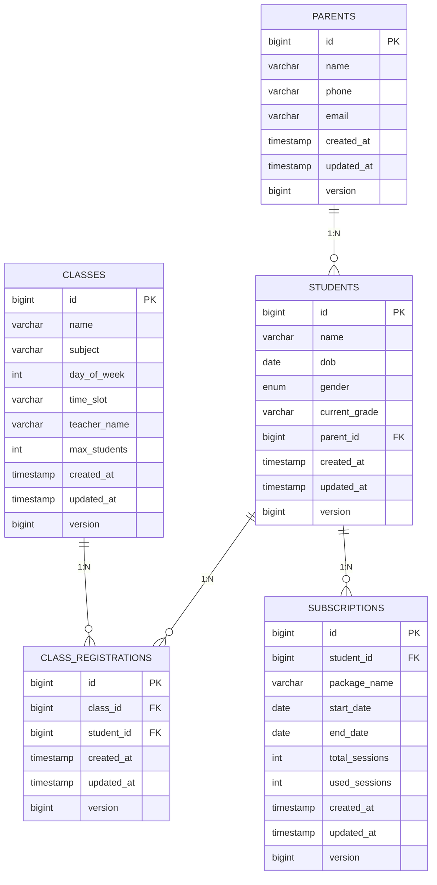

# 🚀 **TeenUp Contest Management System**

**Hệ thống quản lý cuộc thi** với React + Spring Boot + MySQL được đóng gói hoàn toàn trong Docker.

## ⚡ **BẮT ĐẦU NHANH**

### **1. Cài đặt Docker**
```bash
# Windows: Tải Docker Desktop từ docker.com
# Linux: 
sudo apt update && curl -fsSL https://get.docker.com | sh
sudo usermod -aG docker $USER && sudo systemctl start docker

# macOS: Tải Docker Desktop từ docker.com
```

### **2. Khởi động hệ thống**
```bash
# Linux/macOS/WSL
./teenup.sh start

# Windows  
teenup.bat start
```

### **3. Truy cập ứng dụng**
- 🌐 **Frontend:** http://localhost:3000
- 🔧 **Backend API:** http://localhost:8081/api
- 🗄️ **Database:** localhost:3306

---

## 💻 **CÁC LỆNH CƠ BẢN**

### **Universal Scripts:**
```bash
# Khởi động
./teenup.sh start        # Linux/macOS/WSL
teenup.bat start         # Windows

# Dừng hệ thống
./teenup.sh stop         # Linux/macOS/WSL  
teenup.bat stop          # Windows

# Kiểm tra trạng thái
./teenup.sh status       # Linux/macOS/WSL
teenup.bat status        # Windows

# Kiểm tra sức khỏe hệ thống
./teenup.sh health       # Linux/macOS/WSL
teenup.bat health        # Windows

# Thông tin hệ thống
./teenup.sh info         # Linux/macOS/WSL
teenup.bat info          # Windows
```

### **Docker Commands:**
```bash
# Xem logs
docker compose logs -f            # Tất cả services
docker compose logs -f backend    # Chỉ backend
docker compose logs -f frontend   # Chỉ frontend
docker compose logs -f db         # Chỉ database

# Quản lý containers
docker compose ps                 # Xem trạng thái
docker compose restart backend    # Restart backend
docker compose down -v            # Dừng + xóa dữ liệu
```

---

## 🏗️ **KIẾN TRÚC HỆ THỐNG**

### **Technology Stack:**
- **Frontend:** React 18 + Vite + Ant Design + Axios
- **Backend:** Spring Boot 3 + Java 21 + MySQL 8 + JPA
- **Container:** Docker + Docker Compose
- **Scripts:** Cross-platform shell scripts (bash + batch)

### **Database Schema:**

```mermaid
erDiagram
    PARENTS ||--o{ STUDENTS : "1:N"
    STUDENTS ||--o{ CLASS_REGISTRATIONS : "1:N"
    CLASSES ||--o{ CLASS_REGISTRATIONS : "1:N"
    STUDENTS ||--o{ SUBSCRIPTIONS : "1:N"
    
    PARENTS {
        bigint id PK
        varchar name
        varchar phone
        varchar email
        timestamp created_at
        timestamp updated_at
        bigint version
    }
    
    STUDENTS {
        bigint id PK
        varchar name
        date dob
        enum gender
        varchar current_grade
        bigint parent_id FK
        timestamp created_at
        timestamp updated_at
        bigint version
    }
    
    CLASSES {
        bigint id PK
        varchar name
        varchar subject
        int day_of_week
        varchar time_slot
        varchar teacher_name
        int max_students
        timestamp created_at
        timestamp updated_at
        bigint version
    }
    
    CLASS_REGISTRATIONS {
        bigint id PK
        bigint class_id FK
        bigint student_id FK
        timestamp created_at
        timestamp updated_at
        bigint version
    }
    
    SUBSCRIPTIONS {
        bigint id PK
        bigint student_id FK
        varchar package_name
        date start_date
        date end_date
        int total_sessions
        int used_sessions
        timestamp created_at
        timestamp updated_at
        bigint version
    }
```

### **Business Rules:**
- Học sinh phải thuộc về một phụ huynh
- Sức chứa lớp không được vượt quá `maxStudents`
- Số buổi học sử dụng không được vượt quá tổng buổi
- Không được trùng lịch học cho cùng một học sinh
- Phụ huynh có học sinh không thể bị xóa
- Gói học đã phát sinh buổi không thể bị xóa

---

## 📊 **DỮ LIỆU MẪU**

Hệ thống tự động tạo dữ liệu mẫu khi khởi động:

### **👨‍👩‍👧‍👦 Phụ huynh (2):**
- **Nguyen Van A** - 📞 0901111111, 📧 a@example.com
- **Tran Thi B** - 📞 0902222222, 📧 b@example.com

### **👨‍🎓 Học sinh (3):**
- **Minh** (Lớp 7) - Phụ huynh: Nguyen Van A
- **Lan** (Lớp 8) - Phụ huynh: Nguyen Van A  
- **Hoang** (Lớp 6) - Phụ huynh: Tran Thi B

### **📚 Lớp học (3):**
- **Toán Nâng Cao** - Thứ 3, 14:00-15:30, Thầy A
- **Tiếng Anh A2** - Thứ 5, 08:00-09:30, Cô B
- **Khoa học Vui** - Thứ 7, 09:00-10:30, Thầy C

### **🎁 Gói học:**
- **Basic-12** (Minh): 12 buổi, 0 đã sử dụng
- **Basic-08** (Lan): 8 buổi, 1 đã sử dụng

---

## 🔧 **TROUBLESHOOTING**

### **Port bị chiếm:**
```bash
# Linux/macOS
sudo lsof -i :3000 && sudo kill -9 <PID>

# Windows
netstat -ano | findstr ":3000" && taskkill /PID <PID> /F
```

### **Docker không chạy:**
```bash
# Linux
sudo systemctl start docker

# Windows/macOS: Khởi động Docker Desktop
```

### **Reset toàn bộ:**
```bash
docker compose down -v
docker system prune -a
./teenup.sh start    # hoặc teenup.bat start
```

### **Backend không kết nối:**
```bash
# Kiểm tra backend logs
docker compose logs backend

# Kiểm tra database
docker compose exec db mysqladmin ping -h localhost -u root -prootpass
```

### **Frontend không load:**
```bash
# Kiểm tra frontend logs
docker compose logs frontend

# Restart frontend
docker compose restart frontend
```

---

## 🛠️ **PHÁT TRIỂN**

### **Local Development:**

**Frontend (React):**
```bash
cd frontend
npm install
npm run dev              # http://localhost:5173
```

**Backend (Spring Boot):**
```bash
cd backend/contest
./mvnw spring-boot:run   # http://localhost:8081
```

**Database (MySQL):**
```bash
docker compose up -d db  # localhost:3306
```

### **Environment Variables:**
Hệ thống tự tạo file `.env` với cấu hình:
```bash
MYSQL_ROOT_PASSWORD=rootpass
MYSQL_DATABASE=teenup
MYSQL_USER=teenup
MYSQL_PASSWORD=teenup123
FRONTEND_PORT=3000
BACKEND_PORT=8081
DATABASE_PORT=3306
SPRING_PROFILES_ACTIVE=dev
TZ=Asia/Bangkok
```

### **Build Production:**
```bash
docker compose build --no-cache
docker compose up -d
```

---

## 📡 **API REFERENCE**

### **Quick API Examples:**
```bash
# Lấy danh sách học sinh
curl http://localhost:8081/api/students/list

# Tạo phụ huynh mới
curl -X POST http://localhost:8081/api/parents \
  -H "Content-Type: application/json" \
  -d '{"name":"Nguyen Van C","phone":"0903333333","email":"c@example.com"}'

# Đăng ký học sinh vào lớp
curl -X POST http://localhost:8081/api/classes/1/register \
  -H "Content-Type: application/json" \
  -d '{"studentId":1}'
```

### **Main Endpoints:**
- **Parents:** `/api/parents` - CRUD operations
- **Students:** `/api/students` - CRUD operations  
- **Classes:** `/api/classes` - CRUD + scheduling
- **Registrations:** `/api/classes/{id}/register` - Class enrollment
- **Subscriptions:** `/api/subscriptions` - Package management
- **Dashboard:** `/api/dashboard/overview` - System overview

📋 **Chi tiết đầy đủ:** [`docs/API.md`](docs/API.md)

---

## 📞 **HỖ TRỢ & KIỂM TRA**

### **Kiểm tra nhanh:**
```bash
./teenup.sh health      # Health check toàn diện
./teenup.sh status      # Trạng thái containers  
./teenup.sh info        # Thông tin hệ thống
```

### **URLs quan trọng:**
- 🌐 **Frontend:** http://localhost:3000
- 🔧 **API Docs:** [`docs/API.md`](docs/API.md)
- 📊 **Dashboard:** http://localhost:8081/api/dashboard/overview
- 🗄️ **Database:** localhost:3306 (user: `teenup`, pass: `teenup123`)

### **Logs & Debugging:**
```bash
# Xem tất cả logs
docker compose logs -f

# Xem logs theo service
docker compose logs -f backend
docker compose logs -f frontend  
docker compose logs -f db

# Debug container
docker compose exec backend bash
docker compose exec db mysql -u teenup -p teenup
```

---

## 🚀 **DEPLOYMENT**

### **Production Ready:**
- ✅ **Docker Compose** - Đóng gói hoàn chỉnh
- ✅ **Health Checks** - Tự động kiểm tra dịch vụ
- ✅ **Auto Restart** - Tự động khởi động lại khi lỗi
- ✅ **Data Persistence** - MySQL volumes được bảo toàn
- ✅ **Cross Platform** - Linux/Windows/macOS

### **Scaling Considerations:**
- **Load Balancer:** Nginx reverse proxy cho frontend
- **Database:** MySQL Master-Slave replication
- **Cache:** Redis cho session management
- **Monitoring:** Prometheus + Grafana
- **Logging:** ELK Stack

---

**📅 Cập nhật:** Tháng 8 2025  
**✨ Trạng thái:** Production Ready  
**🔧 Version:** 1.0.0