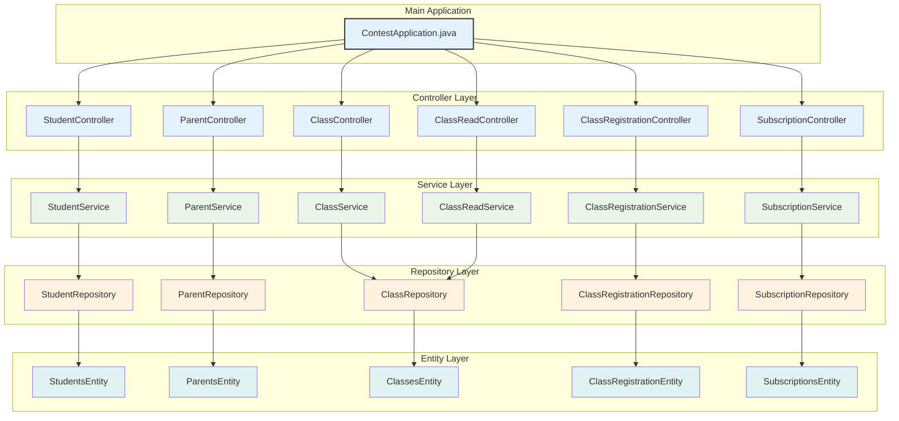
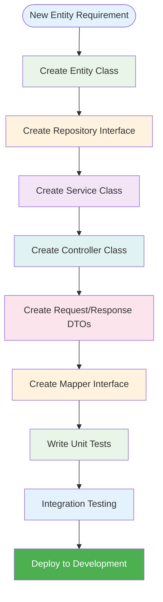

# Development Guide

## **🚀 Setup Development Environment**

### **Prerequisites:**
- **Java 21** - OpenJDK hoặc Oracle JDK
- **Maven 3.8+** - Build tool
- **MySQL 8.0+** - Database
- **IDE** - IntelliJ IDEA, Eclipse, hoặc VS Code

### **1. Clone & Setup:**
```bash
# Clone repository
git clone <repository-url>
cd backend/contest

# Install dependencies
mvn clean install
```

### **2. Database Setup:**
```sql
-- Create database
CREATE DATABASE teenup CHARACTER SET utf8mb4 COLLATE utf8mb4_unicode_ci;

-- Create user (optional)
CREATE USER 'teenup'@'localhost' IDENTIFIED BY 'teenup123';
GRANT ALL PRIVILEGES ON teenup.* TO 'teenup'@'localhost';
FLUSH PRIVILEGES;
```

### **3. Configuration:**
```properties
# application-dev.properties
spring.datasource.url=jdbc:mysql://localhost:3306/teenup?useSSL=false&serverTimezone=UTC
spring.datasource.username=root
spring.datasource.password=123
spring.datasource.driver-class-name=com.mysql.cj.jdbc.Driver

# JPA Configuration
spring.jpa.hibernate.ddl-auto=update
spring.jpa.show-sql=true
spring.jpa.properties.hibernate.format_sql=true
spring.jpa.database-platform=org.hibernate.dialect.MySQL8Dialect
```

### **4. Run Application:**
```bash
# Development mode
mvn spring-boot:run -Dspring-boot.run.profiles=dev

# Or with profile
mvn spring-boot:run -Dspring.profiles.active=dev
```

## **🏗️ Project Structure**

### **Package Organization:**


## **🔧 Development Workflow**

### **1. Adding New Entity:**


### **2. Entity Development Pattern:**
```java
// 1. Create Entity
@Entity
@Table(name = "new_entity")
public class NewEntity extends BaseAuditableEntity {
    @Id
    @GeneratedValue(strategy = GenerationType.IDENTITY)
    private Long id;
    
    @NotBlank @Size(max = 100)
    @Column(name = "name", nullable = false)
    private String name;
    
    // Getters, setters, constructors
}

// 2. Create Repository
public interface NewEntityRepository extends JpaRepository<NewEntity, Long> {
    // Custom queries if needed
}

// 3. Create Service
@Service
@RequiredArgsConstructor
public class NewEntityService {
    private final NewEntityRepository repo;
    private final NewEntityMapper mapper;
    
    @Transactional
    public NewEntityResponse create(CreateNewEntityRequest req) {
        // Business logic
    }
}

// 4. Create Controller
@RestController
@RequestMapping("/api/new-entities")
@RequiredArgsConstructor
public class NewEntityController {
    private final NewEntityService service;
    
    @PostMapping
    public ResponseEntity<NewEntityResponse> create(@Valid @RequestBody CreateNewEntityRequest req) {
        // Controller logic
    }
}
```

## **📝 Coding Standards**

### **1. Naming Conventions:**
- **Classes:** PascalCase (e.g., `StudentService`)
- **Methods:** camelCase (e.g., `getStudentById`)
- **Variables:** camelCase (e.g., `studentName`)
- **Constants:** UPPER_SNAKE_CASE (e.g., `MAX_STUDENTS`)
- **Packages:** lowercase (e.g., `com.teenup.contest.service`)

### **2. Code Organization:**
```java
// 1. Package declaration
package com.teenup.contest.service;

// 2. Imports (grouped by type)
import com.teenup.contest.dto.request.CreateStudentRequest;
import com.teenup.contest.dto.response.StudentResponse;
import com.teenup.contest.entity.StudentsEntity;
import com.teenup.contest.exception.StudentNotFoundException;
import com.teenup.contest.mapper.StudentMapper;
import com.teenup.contest.repository.StudentsRepository;

// 3. Annotations
@Service
@RequiredArgsConstructor
@Transactional(readOnly = true)

// 4. Class declaration
public class StudentService {
    
    // 5. Dependencies
    private final StudentsRepository repo;
    private final StudentMapper mapper;
    
    // 6. Public methods
    public StudentResponse getById(Long id) {
        // Implementation
    }
    
    // 7. Private helper methods
    private void validateStudent(StudentsEntity student) {
        // Validation logic
    }
}
```

### **3. Exception Handling:**
```java
// Use specific exception types
@Transactional
public StudentResponse getById(Long id) {
    return repo.findById(id)
        .map(mapper::toResponse)
        .orElseThrow(() -> new StudentNotFoundException(id));
}

// Global exception handling
@ControllerAdvice
public class ApiExceptionHandler {
    
    @ExceptionHandler(StudentNotFoundException.class)
    public ResponseEntity<ApiError> handleStudentNotFound(StudentNotFoundException ex) {
        ApiError error = new ApiError(
            ErrorCode.STUDENT_NOT_FOUND,
            ex.getMessage(),
            ex.getPath()
        );
        return ResponseEntity.status(HttpStatus.NOT_FOUND).body(error);
    }
}
```

## **🧪 Testing Strategy**

### **1. Unit Testing:**
```java
@ExtendWith(MockitoExtension.class)
class StudentServiceTest {
    
    @Mock
    private StudentsRepository repo;
    
    @Mock
    private StudentMapper mapper;
    
    @InjectMocks
    private StudentService service;
    
    @Test
    void getById_WhenStudentExists_ReturnsStudentResponse() {
        // Given
        Long id = 1L;
        StudentsEntity entity = new StudentsEntity();
        StudentResponse expected = new StudentResponse(1L, "Test", "Grade 7");
        
        when(repo.findById(id)).thenReturn(Optional.of(entity));
        when(mapper.toResponse(entity)).thenReturn(expected);
        
        // When
        StudentResponse result = service.getById(id);
        
        // Then
        assertThat(result).isEqualTo(expected);
        verify(repo).findById(id);
        verify(mapper).toResponse(entity);
    }
}
```

### **2. Integration Testing:**
```java
@SpringBootTest
@AutoConfigureTestDatabase(replace = AutoConfigureTestDatabase.Replace.NONE)
@Transactional
class StudentControllerIntegrationTest {
    
    @Autowired
    private TestRestTemplate restTemplate;
    
    @Test
    void createStudent_WithValidData_ReturnsCreatedStudent() {
        // Given
        CreateStudentRequest request = new CreateStudentRequest(
            "Test Student", LocalDate.of(2010, 1, 1), 
            Gender.M, "Grade 7", 1L
        );
        
        // When
        ResponseEntity<StudentResponse> response = restTemplate.postForEntity(
            "/api/students", request, StudentResponse.class
        );
        
        // Then
        assertThat(response.getStatusCode()).isEqualTo(HttpStatus.CREATED);
        assertThat(response.getBody()).isNotNull();
        assertThat(response.getBody().name()).isEqualTo("Test Student");
    }
}
```

## **🔍 Debugging & Troubleshooting**

### **1. Common Issues:**
```bash
# Port already in use
netstat -tulpn | grep 8081
kill -9 <PID>

# Database connection issues
mysql -u root -p
SHOW DATABASES;
USE teenup;
SHOW TABLES;

# Maven dependency issues
mvn clean install -U
mvn dependency:tree
```

### **2. Logging Configuration:**
```properties
# application-dev.properties
logging.level.com.teenup.contest=DEBUG
logging.level.org.springframework.web=DEBUG
logging.level.org.hibernate.SQL=DEBUG
logging.level.org.hibernate.type.descriptor.sql.BasicBinder=TRACE
```

### **3. Database Debugging:**
```sql
-- Check table structure
DESCRIBE students;
DESCRIBE parents;
DESCRIBE classes;

-- Check data
SELECT * FROM students;
SELECT * FROM parents;
SELECT * FROM classes;

-- Check foreign key constraints
SELECT 
    TABLE_NAME,
    COLUMN_NAME,
    CONSTRAINT_NAME,
    REFERENCED_TABLE_NAME,
    REFERENCED_COLUMN_NAME
FROM INFORMATION_SCHEMA.KEY_COLUMN_USAGE
WHERE REFERENCED_TABLE_SCHEMA = 'teenup';
```

## **🚀 Performance Optimization**

### **1. Database Optimization:**
```java
// Use fetch joins to avoid N+1 queries
@Query("""
    select s from StudentsEntity s
    join fetch s.parent p
    where s.id = :id
""")
Optional<StudentsEntity> findByIdWithParent(@Param("id") Long id);

// Use pagination for large datasets
@Query("select s from StudentsEntity s")
Page<StudentsEntity> findAll(Pageable pageable);
```

### **2. Caching Strategy:**
```java
// Entity-level caching
@Entity
@Cache(usage = CacheConcurrencyStrategy.READ_WRITE)
public class StudentsEntity {
    // Entity definition
}

// Query result caching
@QueryHints(@QueryHint(name = HINT_CACHEABLE, value = "true"))
List<StudentsEntity> findByCurrentGrade(String grade);
```

### **3. Transaction Optimization:**
```java
// Read-only transactions for queries
@Transactional(readOnly = true)
public List<StudentResponse> getAllStudents() {
    return repo.findAll().stream()
        .map(mapper::toResponse)
        .collect(Collectors.toList());
}

// Batch operations for bulk inserts
@Transactional
public void createMultipleStudents(List<CreateStudentRequest> requests) {
    List<StudentsEntity> entities = requests.stream()
        .map(mapper::toEntity)
        .collect(Collectors.toList());
    repo.saveAll(entities);
}
```

## **📦 Build & Deployment**

### **1. Maven Build:**
```bash
# Clean build
mvn clean install

# Skip tests
mvn clean install -DskipTests

# Run specific profile
mvn clean install -Pprod

# Create executable JAR
mvn clean package
```

### **2. Docker Build:**
```dockerfile
# Multi-stage build
FROM maven:3.9.6-eclipse-temurin-21 AS build
WORKDIR /app
COPY pom.xml .
COPY src ./src
RUN mvn clean package -DskipTests

FROM eclipse-temurin:21-jre-alpine
WORKDIR /app
COPY --from=build /app/target/*.jar app.jar
EXPOSE 8081
CMD ["java", "-jar", "app.jar"]
```

### **3. Environment Configuration:**
```bash
# Development
export SPRING_PROFILES_ACTIVE=dev
export SPRING_DATASOURCE_URL=jdbc:mysql://localhost:3306/teenup

# Production
export SPRING_PROFILES_ACTIVE=prod
export SPRING_DATASOURCE_URL=jdbc:mysql://prod-db:3306/teenup
export SPRING_DATASOURCE_USERNAME=prod_user
export SPRING_DATASOURCE_PASSWORD=prod_password
```

## **🔗 Useful Resources**

### **1. Spring Boot Documentation:**
- [Spring Boot Reference](https://docs.spring.io/spring-boot/docs/current/reference/html/)
- [Spring Data JPA](https://docs.spring.io/spring-data/jpa/docs/current/reference/html/)
- [Spring Web](https://docs.spring.io/spring-framework/docs/current/reference/html/web.html)

### **2. Development Tools:**
- [IntelliJ IDEA](https://www.jetbrains.com/idea/) - Recommended IDE
- [Postman](https://www.postman.com/) - API testing
- [MySQL Workbench](https://www.mysql.com/products/workbench/) - Database management

### **3. Code Quality:**
- [SonarQube](https://www.sonarqube.org/) - Code quality analysis
- [SpotBugs](https://spotbugs.github.io/) - Bug detection
- [Checkstyle](https://checkstyle.org/) - Code style enforcement

---

## **🔗 Related Documentation**

- 🏗️ **[Architecture](ARCHITECTURE.md)** - System architecture overview
- 📖 **[API Endpoints](api-endpoints.md)** - REST API documentation
- 🗄️ **[Database Schema](database-schema.md)** - Database structure
- 🎯 **[Business Logic](BUSINESS-LOGIC.md)** - Business rules and validation
