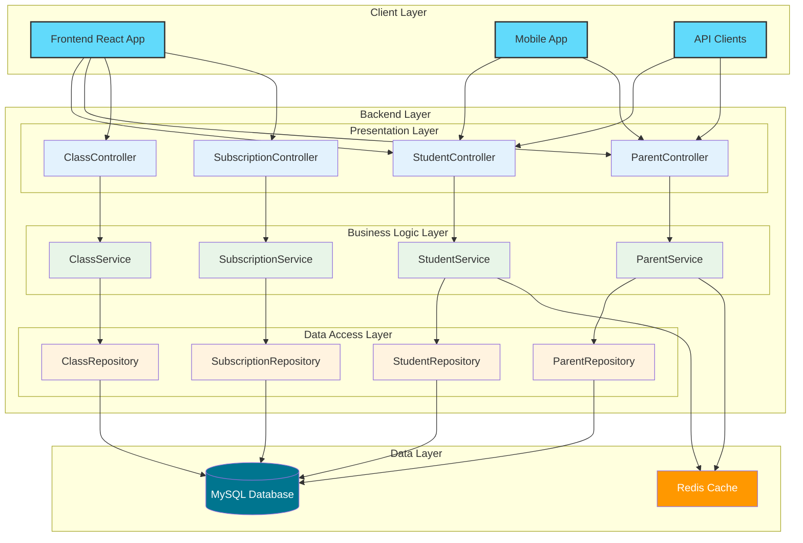

# Backend Documentation

## **📚 Tổng quan**

Backend TeenUp Contest System là một ứng dụng Spring Boot cung cấp REST API cho hệ thống quản lý học sinh, phụ huynh, lớp học và gói học. Hệ thống được thiết kế với kiến trúc layered architecture, sử dụng Spring Data JPA để tương tác với MySQL database.

## **🏗️ Kiến trúc hệ thống**



## **🔧 Technology Stack**

### **Core Framework:**
- **Spring Boot 3.5.4** - Main framework
- **Java 21** - Programming language
- **Spring Data JPA** - Data access layer
- **Spring Web** - REST API layer
- **Spring Validation** - Input validation

### **Database & ORM:**
- **MySQL 8** - Primary database
- **Hibernate** - JPA implementation
- **HikariCP** - Connection pooling

### **Development Tools:**
- **Lombok** - Code generation
- **MapStruct** - Object mapping
- **Maven** - Build tool

## **📁 Tài liệu chi tiết**

📚 **[Xem tất cả tài liệu theo chủ đề →](INDEX.md)**

### **🏗️ [Architecture](ARCHITECTURE.md)**
- Tổng quan kiến trúc hệ thống
- Package structure và dependencies
- Data flow patterns
- Performance optimization strategies

### **🎯 [Business Logic](BUSINESS-LOGIC.md)**
- Business rules và validation logic
- Entity relationship constraints
- Error handling strategies
- Data consistency rules

### **📖 [API Endpoints](api-endpoints.md)**
- REST API documentation
- Request/response examples
- Error codes và messages
- Authentication & authorization

### **🚀 [Development Guide](DEVELOPMENT.md)**
- Setup development environment
- Coding standards và conventions
- Testing strategies
- Performance optimization

## **🚀 Quick Start**

### **1. Prerequisites:**
```bash
# Check Java version
java -version  # Should be Java 21

# Check Maven version
mvn -version   # Should be 3.8+

# Check MySQL
mysql --version # Should be 8.0+
```

### **2. Setup Database:**
```sql
CREATE DATABASE teenup CHARACTER SET utf8mb4 COLLATE utf8mb4_unicode_ci;
```

### **3. Configure Application:**
```properties
# application-dev.properties
spring.datasource.url=jdbc:mysql://localhost:3306/teenup?useSSL=false&serverTimezone=UTC
spring.datasource.username=root
spring.datasource.password=123
```

### **4. Run Application:**
```bash
cd backend/contest
mvn spring-boot:run -Dspring.profiles.active=dev
```

### **5. Verify Setup:**
```bash
# Check if application is running
curl http://localhost:8081/actuator/health

# Check API endpoints
curl http://localhost:8081/api/students/list
```

## **📊 System Features**

### **👨‍👩‍👧‍👦 Parent Management:**
- Create, read, update, delete parents
- Email uniqueness validation
- Phone number validation
- Cascade delete with students

### **👨‍🎓 Student Management:**
- Create, read, update, delete students
- Parent relationship management
- Age and gender validation
- Grade level tracking

### **🏫 Class Management:**
- Create, read, update, delete classes
- Day of week scheduling (1-7)
- Time slot format validation (HH:mm-HH:mm)
- Teacher assignment
- Maximum student capacity

### **📚 Class Registration:**
- Student registration to classes
- Schedule conflict detection
- Capacity validation
- Duplicate registration prevention
- Student transfer between classes

### **📦 Subscription Management:**
- Package creation and management
- Session tracking (total vs. used)
- Date range validation
- Session usage tracking
- Subscription status management

## **🔍 Key Business Rules**

### **Data Validation:**
- **Email uniqueness** cho parents
- **Age validation** cho students (past date)
- **Schedule conflict prevention** cho class registrations
- **Capacity management** cho classes
- **Date range validation** cho subscriptions

### **Relationship Constraints:**
- **Parent deletion** blocked nếu có students
- **Student deletion** blocked nếu có registrations hoặc active subscriptions
- **Class deletion** blocked nếu có students registered

### **Business Logic:**
- **Schedule conflict detection** algorithm
- **Optimistic locking** với version field
- **Transaction management** cho complex operations
- **Cascade operations** cho related entities

## **📈 Performance Features**

### **Database Optimization:**
- **JPA fetch joins** để tránh N+1 queries
- **Custom queries** cho complex operations
- **Indexes** trên foreign keys và search fields
- **Connection pooling** với HikariCP

### **Caching Strategy:**
- **Entity caching** với Hibernate second-level cache
- **Query result caching** cho read operations
- **Session management** optimization

### **Transaction Management:**
- **Read-only transactions** cho queries
- **Optimistic locking** cho concurrent updates
- **Proper transaction boundaries** cho business operations

## **🛡️ Security & Error Handling**

### **Input Validation:**
- **Bean Validation** với annotations
- **Custom validation** cho business rules
- **Request DTOs** với validation constraints

### **Error Handling:**
- **Global exception handler** (`ApiExceptionHandler`)
- **Structured error responses** với `ErrorCode`
- **Business logic exceptions** cho các trường hợp đặc biệt
- **HTTP status codes** phù hợp

### **Data Integrity:**
- **JPA constraints** (unique constraints, foreign keys)
- **Optimistic locking** với `@Version`
- **Transaction management** với `@Transactional`

## **🧪 Testing Strategy**

### **Unit Testing:**
- **Service layer testing** với Mockito
- **Repository testing** với @DataJpaTest
- **Controller testing** với @WebMvcTest

### **Integration Testing:**
- **End-to-end testing** với @SpringBootTest
- **Database integration** testing
- **API endpoint testing** với TestRestTemplate

### **Test Coverage:**
- **Business logic coverage** > 90%
- **API endpoint coverage** > 95%
- **Exception handling coverage** > 100%

## **📦 Build & Deployment**

### **Maven Build:**
```bash
# Development build
mvn clean install

# Production build
mvn clean package -Pprod

# Skip tests
mvn clean install -DskipTests
```

### **Docker Support:**
- **Multi-stage Dockerfile** cho production builds
- **Environment-specific configuration**
- **Health checks** và monitoring
- **Container orchestration** support

### **Environment Configuration:**
- **Development:** Local MySQL, detailed logging, data seeding
- **Production:** Production database, minimal logging, no seeding
- **Docker:** Containerized database, optimized settings

## **🔗 API Documentation**

### **Base URL:**
```
http://localhost:8081/api
```

### **Main Endpoints:**
- **Students:** `/api/students/*`
- **Parents:** `/api/parents/*`
- **Classes:** `/api/classes/*`
- **Subscriptions:** `/api/subscriptions/*`

### **API Testing:**
- **Postman Collection** available
- **Swagger/OpenAPI** documentation
- **cURL examples** trong documentation

## **📊 Monitoring & Logging**

### **Health Checks:**
- **Database connectivity** checks
- **Application health** endpoints
- **Custom health indicators** cho business metrics

### **Logging Strategy:**
- **Structured logging** với SLF4J + Logback
- **SQL logging** trong development mode
- **Business operation logging** cho audit trail
- **Performance monitoring** logs

### **Metrics:**
- **Request/response times**
- **Database query performance**
- **Memory usage** và garbage collection
- **Business metrics** (registrations, subscriptions)

## **🚀 Future Enhancements**

### **Planned Features:**
- **Authentication & Authorization** với JWT
- **Role-based access control** (RBAC)
- **Audit logging** cho all operations
- **Real-time notifications** với WebSocket
- **File upload** cho student documents

### **Performance Improvements:**
- **Redis caching** cho frequently accessed data
- **Database read replicas** cho scaling
- **Async processing** cho heavy operations
- **API rate limiting** và throttling

### **Integration Features:**
- **Third-party payment** integration
- **SMS/Email notifications**
- **Calendar integration** (Google Calendar, Outlook)
- **Reporting and analytics** dashboard

---

## **🤝 Contributing**

### **Development Process:**
1. **Fork** repository
2. **Create feature branch** (`git checkout -b feature/amazing-feature`)
3. **Commit changes** (`git commit -m 'Add amazing feature'`)
4. **Push to branch** (`git push origin feature/amazing-feature`)
5. **Open Pull Request**

### **Code Standards:**
- **Follow Java coding conventions**
- **Use meaningful names** cho variables và methods
- **Write comprehensive tests** cho new features
- **Update documentation** khi thay đổi API

### **Testing Requirements:**
- **Unit tests** cho business logic
- **Integration tests** cho API endpoints
- **Test coverage** > 90%
- **Performance tests** cho critical paths

---

## **📞 Support & Contact**

### **Development Team:**
- **Backend Lead:** [Your Name]
- **Email:** [your.email@company.com]
- **Slack:** [@your-username]

### **Documentation:**
- **Technical Questions:** Check documentation trước
- **Bug Reports:** Create GitHub issue với detailed description
- **Feature Requests:** Use GitHub issue template

### **Resources:**
- **Spring Boot Docs:** [https://docs.spring.io/spring-boot/](https://docs.spring.io/spring-boot/)
- **JPA/Hibernate Docs:** [https://hibernate.org/orm/documentation/](https://hibernate.org/orm/documentation/)
- **MySQL Docs:** [https://dev.mysql.com/doc/](https://dev.mysql.com/doc/)

---

**Last Updated:** December 2024  
**Version:** 1.0.0  
**Maintainer:** Backend Development Team
