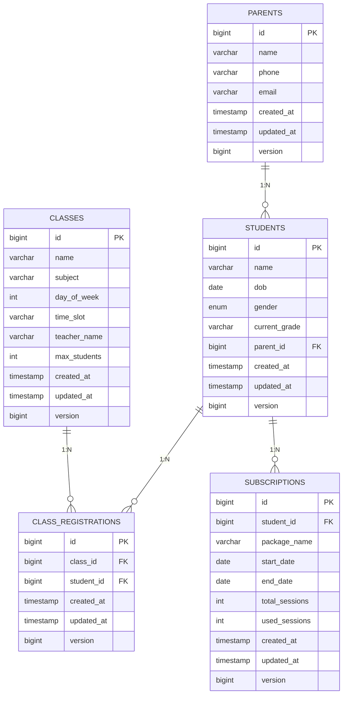

# Database Schema

### **1. Entity Relationships:**


## **🛡️ Security & Validation**

### **Input Validation:**
- **Bean Validation** với annotations: `@NotNull`, `@NotBlank`, `@Size`, `@Email`, `@Pattern`
- **Custom validation** cho business rules (schedule conflict, capacity check)
- **Request DTOs** với validation constraints

### **Error Handling:**
- **Global exception handler** (`ApiExceptionHandler`)
- **Structured error responses** với `ErrorCode`, HTTP status, message
- **Business logic exceptions** cho các trường hợp đặc biệt

### **Data Integrity:**
- **JPA constraints** (unique constraints, foreign keys)
- **Optimistic locking** với `@Version`
- **Transaction management** với `@Transactional`

## **🚀 Performance & Optimization**

### **Database Optimization:**
- **JPA fetch joins** để tránh N+1 queries
- **Custom queries** cho complex operations
- **Indexes** trên foreign keys và search fields

### **Caching Strategy:**
- **Entity caching** với Hibernate second-level cache
- **Query result caching** cho read operations
- **Connection pooling** với HikariCP

### **Transaction Management:**
- **Read-only transactions** cho queries
- **Optimistic locking** cho concurrent updates
- **Proper transaction boundaries** cho business operations

## **🔧 Configuration & Environment**

### **Application Properties:**
```properties
# Server Configuration
server.port=8081
spring.application.name=contest

# Database Configuration
spring.jpa.hibernate.ddl-auto=update
spring.jpa.show-sql=true
spring.jpa.database-platform=org.hibernate.dialect.MySQL8Dialect

# Development Profile
spring.profiles.active=dev
```


## 2. Parents
- **id** (PK, BIGINT, auto increment)
- **name** (VARCHAR 100, NOT NULL)
- **phone** (VARCHAR 20, NOT NULL)
- **email** (VARCHAR 100, NOT NULL, unique)
- **created_at** (TIMESTAMP, NOT NULL)
- **updated_at** (TIMESTAMP, NULL)
- **version** (BIGINT, optimistic locking)

---

## 2. Students
- **id** (PK, BIGINT, auto increment)
- **name** (VARCHAR 100, NOT NULL)
- **dob** (DATE, NOT NULL)
- **gender** (CHAR(1), NOT NULL, 'M'/'F')
- **current_grade** (VARCHAR 20, NOT NULL)
- **parent_id** (FK → Parents.id, NOT NULL)
- **created_at** (TIMESTAMP, NOT NULL)
- **updated_at** (TIMESTAMP, NULL)
- **version** (BIGINT)

---

## 3. Classes
- **id** (PK, BIGINT, auto increment)
- **name** (VARCHAR 100, NOT NULL)
- **subject** (VARCHAR 100, NOT NULL)
- **day_of_week** (INT, 1=Monday, ... 7=Sunday)
- **time_slot** (VARCHAR 20, ví dụ "14:00-15:30")
- **teacher_name** (VARCHAR 100)
- **max_students** (INT, NOT NULL)
- **created_at** (TIMESTAMP, NOT NULL)
- **updated_at** (TIMESTAMP, NULL)
- **version** (BIGINT)

---

## 4. ClassRegistrations
- **id** (PK, BIGINT, auto increment)
- **class_id** (FK → Classes.id, NOT NULL)
- **student_id** (FK → Students.id, NOT NULL)
- UNIQUE (class_id, student_id) – tránh trùng đăng ký

---

## 5. Subscriptions
- **id** (PK, BIGINT, auto increment)
- **student_id** (FK → Students.id, NOT NULL)
- **package_name** (VARCHAR 100, NOT NULL)
- **start_date** (DATE, NOT NULL)
- **end_date** (DATE, NOT NULL)
- **total_sessions** (INT, NOT NULL)
- **used_sessions** (INT, NOT NULL, default 0)
- **created_at** (TIMESTAMP, NOT NULL)
- **updated_at** (TIMESTAMP, NULL)
- **version** (BIGINT)
