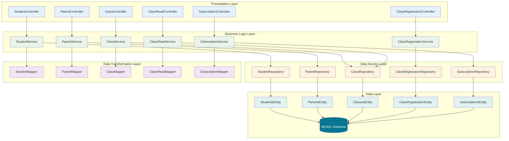
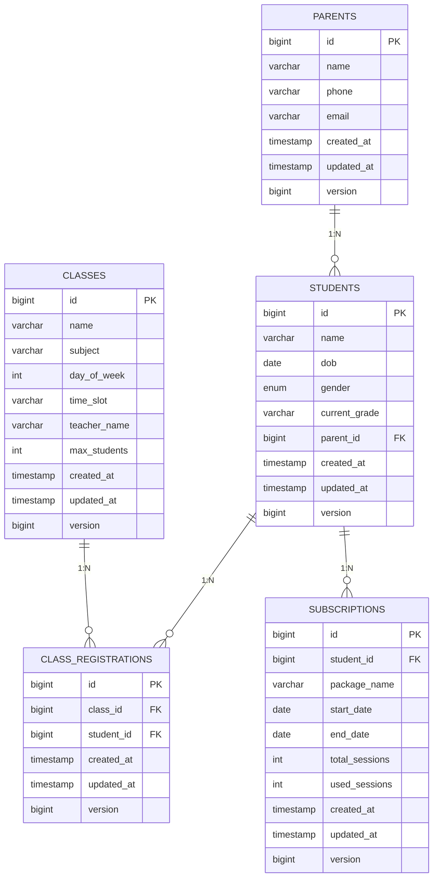
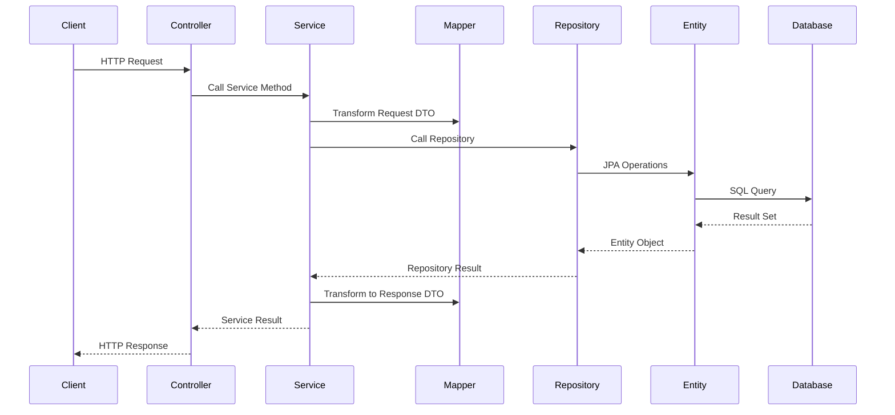

# Backend Architecture

## **🏗️ Tổng quan kiến trúc**



## **🔧 Technology Stack**

### **Core Framework:**
- **Spring Boot 3.5.4** - Main framework
- **Java 21** - Programming language
- **Spring Data JPA** - Data access layer
- **Spring Web** - REST API layer
- **Spring Validation** - Input validation

### **Database & ORM:**
- **MySQL 8** - Primary database
- **Hibernate** - JPA implementation
- **HikariCP** - Connection pooling

### **Development Tools:**
- **Lombok** - Code generation
- **MapStruct** - Object mapping
- **Maven** - Build tool

## **📁 Package Structure**

```
com.teenup.contest/
├── 📁 controller/           # REST API endpoints
│   ├── StudentController.java
│   ├── ParentController.java
│   ├── ClassController.java
│   ├── ClassReadController.java
│   ├── ClassRegistrationController.java
│   └── SubscriptionController.java
├── 📁 service/              # Business logic
│   ├── StudentService.java
│   ├── ParentService.java
│   ├── ClassService.java
│   ├── ClassReadService.java
│   ├── ClassRegistrationService.java
│   └── SubscriptionService.java
├── 📁 repository/           # Data access
│   ├── StudentsRepository.java
│   ├── ParentsRepository.java
│   ├── ClassesRepository.java
│   ├── ClassRegistrationsRepository.java
│   └── SubscriptionsRepository.java
├── 📁 entity/               # JPA entities
│   ├── StudentsEntity.java
│   ├── ParentsEntity.java
│   ├── ClassesEntity.java
│   ├── ClassRegistrationEntity.java
│   ├── SubscriptionsEntity.java
│   ├── BaseAuditableEntity.java
│   └── Gender.java
├── 📁 dto/                  # Data transfer objects
│   ├── 📁 request/          # Input DTOs
│   └── 📁 response/         # Output DTOs
├── 📁 mapper/               # Object mapping
│   ├── StudentMapper.java
│   ├── ParentMapper.java
│   ├── ClassMapper.java
│   ├── ClassReadMapper.java
│   └── SubscriptionMapper.java
├── 📁 exception/            # Error handling
│   ├── ErrorCode.java
│   ├── BaseException.java
│   ├── ApiExceptionHandler.java
│   └── Specific exceptions...
└── 📁 config/               # Configuration
    └── DevDataSeeder.java
```

## **🔄 Data Flow**

### **1. Entity Relationships:**


### **2. Request Flow:**



### **Environment-specific Config:**
- **Development:** Local MySQL, detailed logging, data seeding
- **Production:** Production database, minimal logging, no seeding
- **Docker:** Containerized database, optimized settings

## **🛡️ Security & Validation**

### **Input Validation:**
- **Bean Validation** với annotations: `@NotNull`, `@NotBlank`, `@Size`, `@Email`, `@Pattern`
- **Custom validation** cho business rules (schedule conflict, capacity check)
- **Request DTOs** với validation constraints

### **Error Handling:**
- **Global exception handler** (`ApiExceptionHandler`)
- **Structured error responses** với `ErrorCode`, HTTP status, message
- **Business logic exceptions** cho các trường hợp đặc biệt

### **Data Integrity:**
- **JPA constraints** (unique constraints, foreign keys)
- **Optimistic locking** với `@Version`
- **Transaction management** với `@Transactional`

## **🚀 Performance & Optimization**

### **Database Optimization:**
- **JPA fetch joins** để tránh N+1 queries
- **Custom queries** cho complex operations
- **Indexes** trên foreign keys và search fields

### **Caching Strategy:**
- **Entity caching** với Hibernate second-level cache
- **Query result caching** cho read operations
- **Connection pooling** với HikariCP

### **Transaction Management:**
- **Read-only transactions** cho queries
- **Optimistic locking** cho concurrent updates
- **Proper transaction boundaries** cho business operations

## **🔧 Configuration & Environment**

### **Application Properties:**
```properties
# Server Configuration
server.port=8081
spring.application.name=contest

# Database Configuration
spring.jpa.hibernate.ddl-auto=update
spring.jpa.show-sql=true
spring.jpa.database-platform=org.hibernate.dialect.MySQL8Dialect

# Development Profile
spring.profiles.active=dev
```

## **📊 Monitoring & Logging**

### **Logging Strategy:**
- **Structured logging** với SLF4J + Logback
- **SQL logging** trong development mode
- **Business operation logging** cho audit trail

### **Health Checks:**
- **Database connectivity** checks
- **Application health** endpoints
- **Custom health indicators** cho business metrics

---

## **🔗 Related Documentation**

📚 **[Xem tất cả tài liệu →](INDEX.md)**

- 📖 **[API Endpoints](api-endpoints.md)** - REST API documentation
- 🎯 **[Business Logic](BUSINESS-LOGIC.md)** - Business rules and validation
- 🚀 **[Development Guide](DEVELOPMENT.md)** - Setup and development
