# Business Logic & Rules

## **🎯 Tổng quan Business Logic**

Backend TeenUp Contest System được thiết kế với các business rules nghiêm ngặt để đảm bảo tính nhất quán và hợp lý của dữ liệu. Tài liệu này mô tả chi tiết các quy tắc nghiệp vụ được implement.

## **👨‍👩‍👧‍👦 Parent Management**

### **1. Parent Creation Rules:**
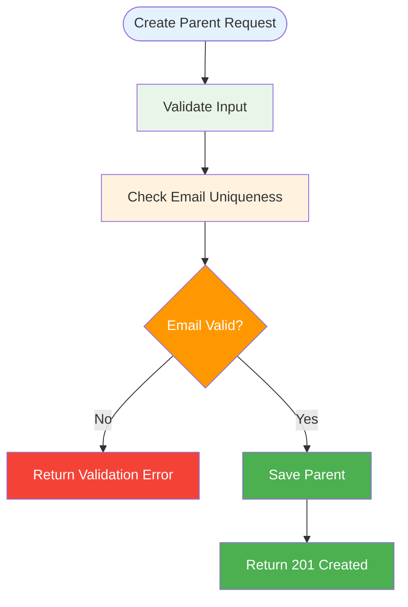

**Business Rules:**
- **Email uniqueness:** Mỗi email chỉ được sử dụng cho 1 phụ huynh
- **Required fields:** `name`, `phone`, `email` là bắt buộc
- **Phone format:** Số điện thoại tối đa 20 ký tự
- **Email format:** Phải đúng định dạng email

### **2. Parent Deletion Rules:**
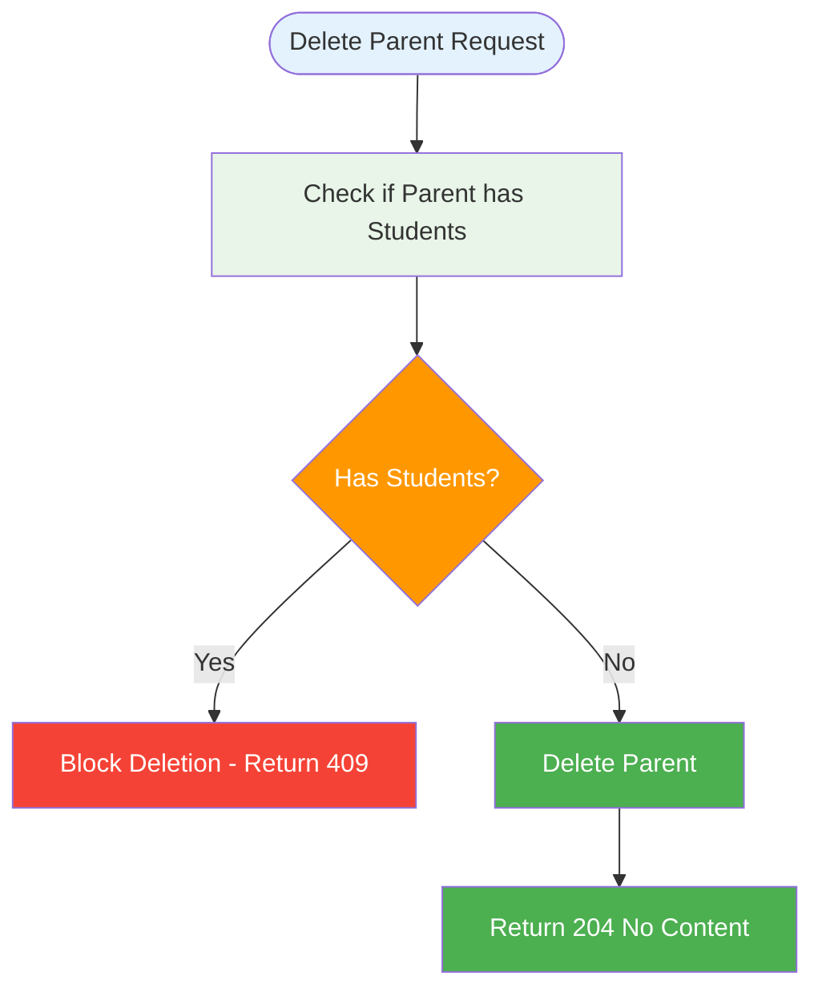

**Business Rules:**
- **Cannot delete if has students:** Phụ huynh đang có học sinh không thể bị xóa
- **Cascade delete:** Nếu xóa phụ huynh, tất cả học sinh liên quan cũng bị xóa

## **👨‍🎓 Student Management**

### **1. Student Creation Rules:**
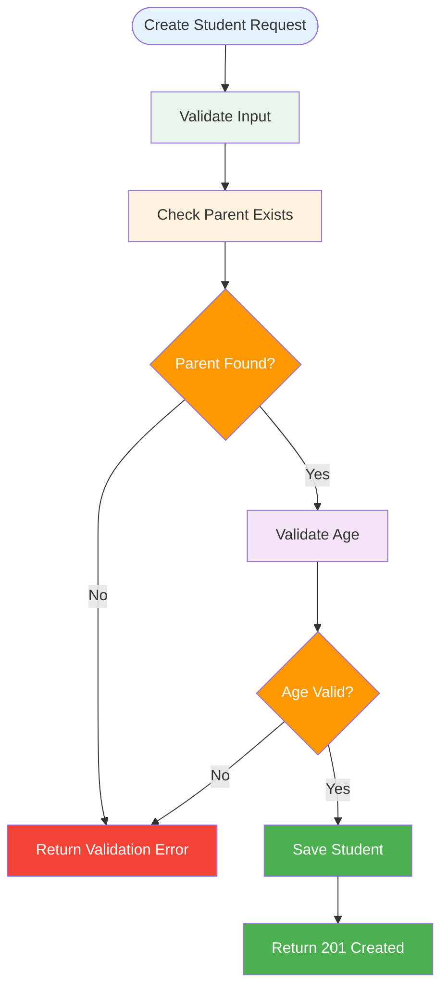

**Business Rules:**
- **Parent must exist:** `parentId` phải trỏ đến phụ huynh tồn tại
- **Age validation:** Ngày sinh phải trước ngày hiện tại
- **Gender validation:** Giới tính phải là `M`, `F`, hoặc `O`
- **Grade validation:** Khối lớp không được để trống

### **2. Student Deletion Rules:**
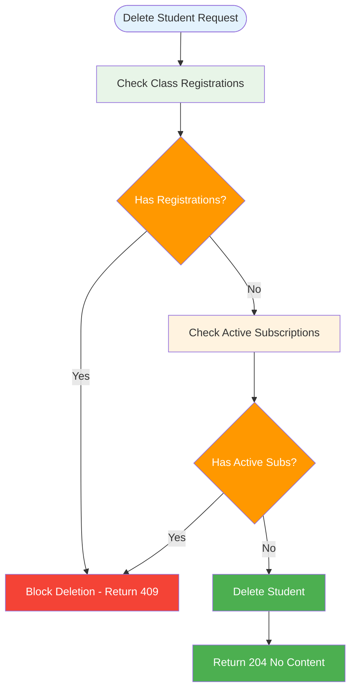

**Business Rules:**
- **Cannot delete if registered:** Học sinh đang đăng ký lớp không thể bị xóa
- **Cannot delete if has subscriptions:** Học sinh có gói học còn hiệu lực không thể bị xóa

## **🏫 Class Management**

### **1. Class Creation Rules:**
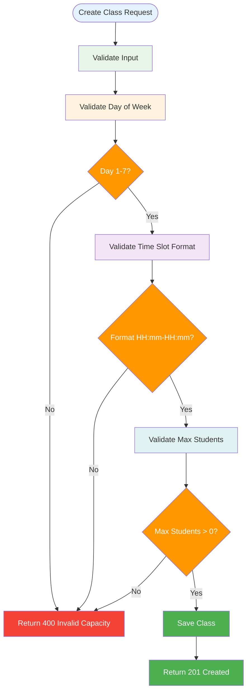

**Business Rules:**
- **Day validation:** `dayOfWeek` phải từ 1-7 (Thứ 2 = 1, Chủ nhật = 7)
- **Time slot format:** Phải đúng định dạng `HH:mm-HH:mm`
- **Capacity validation:** `maxStudents` phải > 0
- **Required fields:** `name`, `subject`, `teacherName` là bắt buộc

### **2. Class Deletion Rules:**
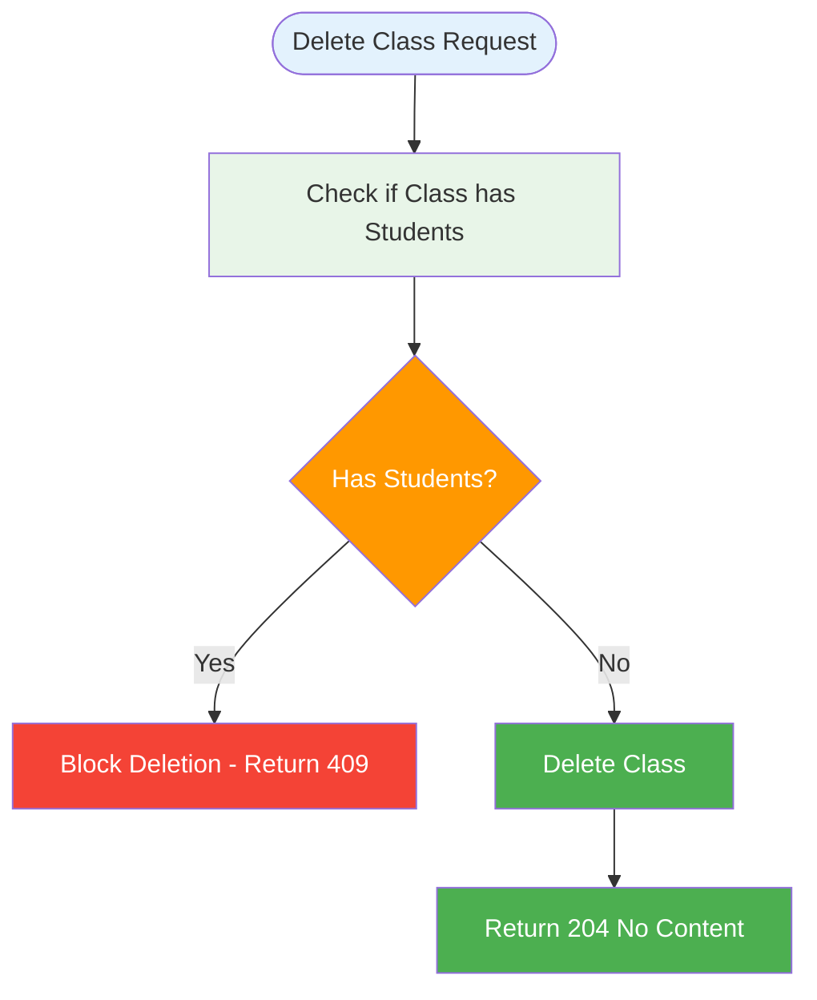

**Business Rules:**
- **Cannot delete if has students:** Lớp đang có học sinh đăng ký không thể bị xóa

## **📚 Class Registration Management**

### **1. Student Registration Rules:**
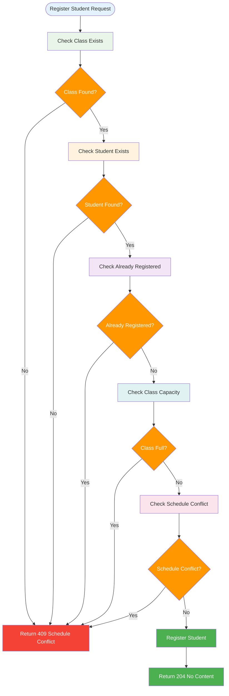

**Business Rules:**
- **No duplicate registration:** Học sinh không thể đăng ký cùng một lớp nhiều lần
- **Capacity check:** Lớp phải còn chỗ trống
- **Schedule conflict prevention:** Không được trùng lịch với lớp khác

### **2. Schedule Conflict Detection:**
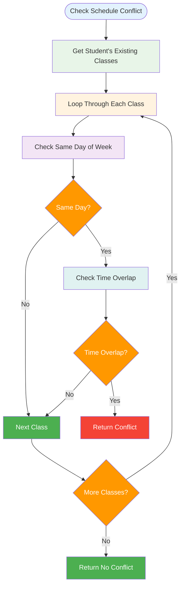

**Time Overlap Algorithm:**
```java
// timeSlot format: "HH:mm-HH:mm"
private boolean isOverlap(String slotA, String slotB) {
    var a = slotA.split("-");
    var b = slotB.split("-");
    LocalTime aStart = LocalTime.parse(a[0]);
    LocalTime aEnd   = LocalTime.parse(a[1]);
    LocalTime bStart = LocalTime.parse(b[0]);
    LocalTime bEnd   = LocalTime.parse(b[1]);

    return aStart.isBefore(bEnd) && bStart.isBefore(aEnd);
}
```

## **📦 Subscription Management**

### **1. Subscription Creation Rules:**
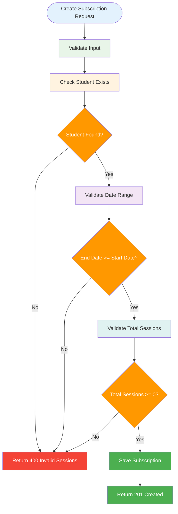

**Business Rules:**
- **Student must exist:** `studentId` phải trỏ đến học sinh tồn tại
- **Date validation:** `endDate` phải >= `startDate`
- **Sessions validation:** `totalSessions` phải >= 0

### **2. Session Usage Rules:**
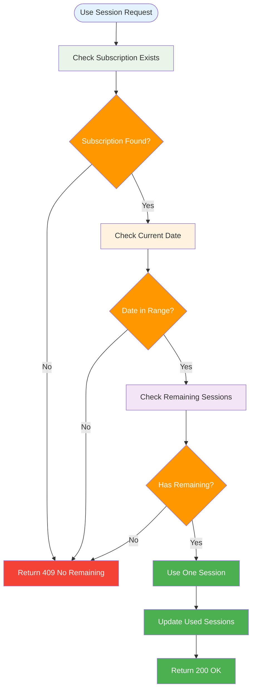

**Business Rules:**
- **Date range check:** Chỉ có thể dùng buổi trong khoảng `startDate` - `endDate`
- **Session availability:** Phải còn buổi chưa sử dụng
- **Atomic operation:** Sử dụng buổi là atomic operation

### **3. Subscription Update Rules:**
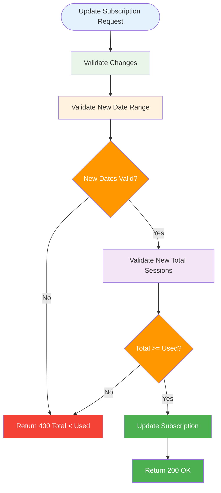

**Business Rules:**
- **Date consistency:** `endDate` phải >= `startDate`
- **Session consistency:** `totalSessions` mới phải >= `usedSessions` hiện tại

## **🔄 Data Consistency Rules**

### **1. Optimistic Locking:**
- **Version field:** Mỗi entity có field `version` để optimistic locking
- **Concurrent updates:** Ngăn chặn lost update problems
- **Version increment:** Tự động tăng version khi update

### **2. Transaction Management:**
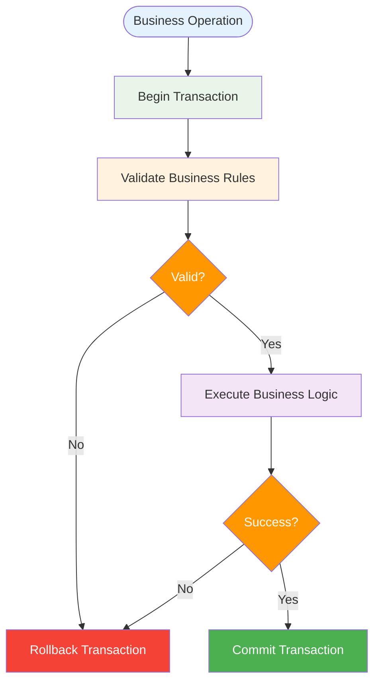

**Transaction Rules:**
- **Read operations:** Sử dụng `@Transactional(readOnly = true)`
- **Write operations:** Sử dụng `@Transactional`
- **Rollback on exception:** Tự động rollback khi có exception

### **3. Cascade Operations:**
- **Parent deletion:** Cascade delete tất cả students
- **Student deletion:** Cascade delete tất cả registrations và subscriptions
- **Class deletion:** Cascade delete tất cả registrations

## **📊 Error Handling Strategy**

### **1. Error Code Structure:**
```java
public enum ErrorCode {
    // Parent errors
    PARENT_NOT_FOUND("PARENT_NOT_FOUND", HttpStatus.NOT_FOUND, "Không tìm thấy phụ huynh"),
    PARENT_HAS_STUDENTS("PARENT_HAS_STUDENTS", HttpStatus.CONFLICT, "Phụ huynh đang có học sinh"),
    
    // Student errors
    STUDENT_NOT_FOUND("STUDENT_NOT_FOUND", HttpStatus.NOT_FOUND, "Không tìm thấy học sinh"),
    STUDENT_HAS_REGISTRATIONS("STUDENT_HAS_REGISTRATIONS", HttpStatus.CONFLICT, "Học sinh đang có đăng ký"),
    
    // Class errors
    CLASS_NOT_FOUND("CLASS_NOT_FOUND", HttpStatus.NOT_FOUND, "Không tìm thấy lớp học"),
    CLASS_FULL("CLASS_FULL", HttpStatus.CONFLICT, "Lớp đã đủ số lượng"),
    SCHEDULE_CONFLICT("SCHEDULE_CONFLICT", HttpStatus.CONFLICT, "Trùng lịch với lớp khác"),
    
    // Subscription errors
    SUBSCRIPTION_INACTIVE("SUBSCRIPTION_INACTIVE", HttpStatus.CONFLICT, "Gói học chưa hiệu lực"),
    NO_REMAINING_SESSIONS("NO_REMAINING_SESSIONS", HttpStatus.CONFLICT, "Đã dùng hết số buổi")
}
```

### **2. Error Response Format:**
```json
{
  "timestamp": "2025-08-13T10:00:00Z",
  "status": 409,
  "code": "SCHEDULE_CONFLICT",
  "message": "Học sinh 3 trùng lịch với lớp khác vào day=2, time=14:00-15:30",
  "path": "/api/classes/1/register"
}
```

## **🔍 Validation Rules Summary**

| Entity | Field | Validation Rule | Error Code |
|--------|-------|-----------------|------------|
| Parent | email | Unique, Email format | VALIDATION_FAILED |
| Parent | name | Not blank, Max 100 chars | VALIDATION_FAILED |
| Parent | phone | Not blank, Max 20 chars | VALIDATION_FAILED |
| Student | parentId | Must exist | STUDENT_NOT_FOUND |
| Student | dob | Past date | VALIDATION_FAILED |
| Student | gender | M/F/O | VALIDATION_FAILED |
| Class | dayOfWeek | 1-7 | INVALID_DAY |
| Class | timeSlot | HH:mm-HH:mm format | VALIDATION_FAILED |
| Class | maxStudents | > 0 | VALIDATION_FAILED |
| Subscription | dates | endDate >= startDate | SUBSCRIPTION_INVALID_DATES |
| Subscription | sessions | total >= used | SUBSCRIPTION_TOTAL_LT_USED |

---

## **🔗 Related Documentation**

📚 **[Xem tất cả tài liệu →](INDEX.md)**

- 🏗️ **[Architecture](ARCHITECTURE.md)** - System architecture overview
- 📖 **[API Endpoints](api-endpoints.md)** - REST API documentation
