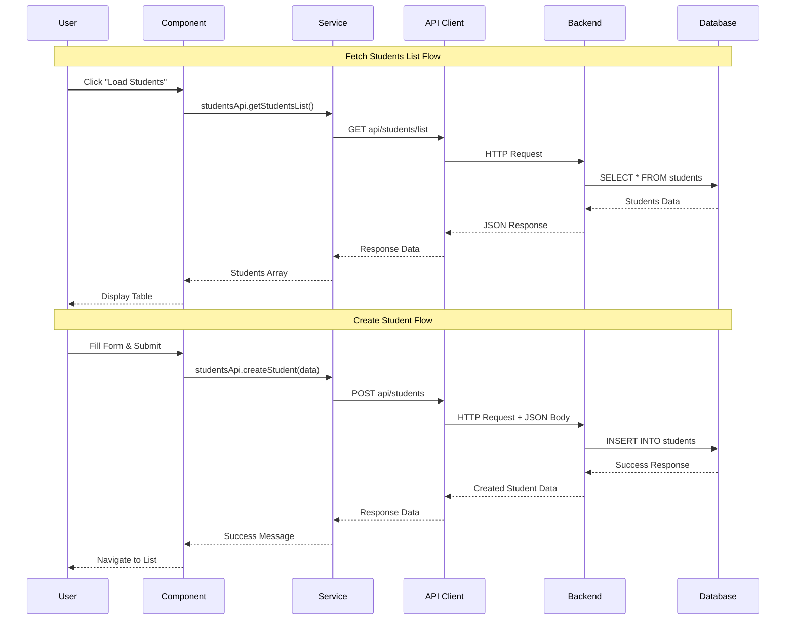
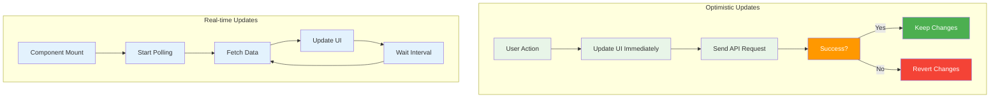
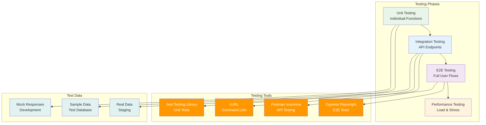
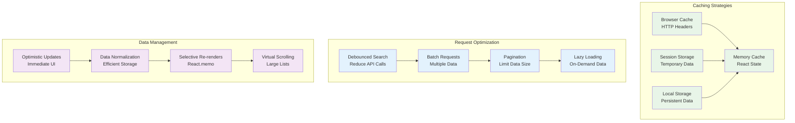

# 🔌 API Integration

Hướng dẫn tích hợp **Frontend React** với **Backend Spring Boot API** của TeenUp Contest Management System.

## **🌐 API Overview**

### **Base URL:**
- **Development:** `http://localhost:8081`
- **Docker:** `http://localhost:8081`
- **Production:** `https://your-domain.com`

### **API Endpoints:**

```mermaid
graph TD
    subgraph "API Endpoints Structure"
        subgraph "Student Management"
            S1[GET /api/students/list]
            S2[GET /api/students/&#123;id&#125;]
            S3[POST /api/students]
            S4[PUT /api/students/&#123;id&#125;]
            S5[DELETE /api/students/&#123;id&#125;]
        end
        
        subgraph "Parent Management"
            P1[GET /api/parents/list]
            P2[GET /api/parents/&#123;id&#125;]
            P3[POST /api/parents]
            P4[PUT /api/parents/&#123;id&#125;]
            P5[DELETE /api/parents/&#123;id&#125;]
        end
        
        subgraph "Class Management"
            C1[GET /api/classes]
            C2[GET /api/classes/&#123;id&#125;]
            C3[POST /api/classes]
            C4[PUT /api/classes/&#123;id&#125;]
            C5[DELETE /api/classes/&#123;id&#125;]
            C6[POST /api/classes/&#123;id&#125;/register]
        end
        
        subgraph "Subscription Management"
            SU1[GET /api/subscriptions]
            SU2[GET /api/subscriptions/&#123;id&#125;]
            SU3[POST /api/subscriptions]
            SU4[PUT /api/subscriptions/&#123;id&#125;]
            SU5[DELETE /api/subscriptions/&#123;id&#125;]
            SU6[POST /api/subscriptions/&#123;id&#125;/use-session]
        end
        
        subgraph "Dashboard"
            D1[GET /api/dashboard/statistics]
        end
    end
    
    style S1 fill:#e8f5e8
    style S2 fill:#e8f5e8
    style S3 fill:#e8f5e8
    style S4 fill:#e8f5e8
    style S5 fill:#e8f5e8
    style P1 fill:#f3e5f5
    style P2 fill:#f3e5f5
    style P3 fill:#f3e5f5
    style P4 fill:#f3e5f5
    style P5 fill:#f3e5f5
    style C1 fill:#fff3e0
    style C2 fill:#fff3e0
    style C3 fill:#fff3e0
    style C4 fill:#fff3e0
    style C5 fill:#fff3e0
    style C6 fill:#fff3e0
    style SU1 fill:#fce4ec
    style SU2 fill:#fce4ec
    style SU3 fill:#fce4ec
    style SU4 fill:#fce4ec
    style SU5 fill:#fce4ec
    style SU6 fill:#fce4ec
    style D1 fill:#e0f2f1
```


## **🔧 Configuration**

### **API Config File:**
```javascript
// src/config/api.config.js
const API_CONFIG = {
  development: {
    baseURL: 'http://localhost:8081',
    useProxy: true,      // Vite proxy
  },
  docker: {
    baseURL: 'http://localhost:8081',
    useProxy: false,     // Direct calls
  },
  production: {
    baseURL: 'https://your-domain.com',
    useProxy: false,
  }
};
```

### **Environment Variables:**
```bash
# .env
VITE_API_BASE_URL=http://localhost:8081
VITE_DOCKER=false
```

## **📡 HTTP Client Setup**

### **Axios Configuration:**
```javascript
// src/services/api.js
import axios from 'axios';
import { API_BASE_URL, USE_PROXY } from '../config/api.config.js';

const baseURL = USE_PROXY ? '/api' : API_BASE_URL + '/api';

const apiClient = axios.create({
  baseURL: baseURL,
  headers: {
    'Content-Type': 'application/json',
  },
  timeout: 10000,
});

// Request interceptor
apiClient.interceptors.request.use(
  (config) => {
    // Add auth token, logging, etc.
    return config;
  },
  (error) => Promise.reject(error)
);

// Response interceptor
apiClient.interceptors.response.use(
  (response) => response,
  (error) => {
    // Global error handling
    return Promise.reject(error);
  }
);
```

## **🎯 Service Layer Pattern**

### **Entity Service Structure:**
```javascript
// src/services/students.api.js
import apiClient from './api.js';

export const studentsApi = {
  // Get all students
  getStudentsList: async (params = {}) => {
    const response = await apiClient.get('/students/list', { params });
    return response.data;
  },

  // Get student by ID
  getStudentById: async (id) => {
    const response = await apiClient.get(`/students/${id}`);
    return response.data;
  },

  // Create new student
  createStudent: async (studentData) => {
    const response = await apiClient.post('/students', studentData);
    return response.data;
  },

  // Update student
  updateStudent: async (id, studentData) => {
    const response = await apiClient.put(`/students/${id}`, studentData);
    return response.data;
  },

  // Delete student
  deleteStudent: async (id) => {
    const response = await apiClient.delete(`/students/${id}`);
    return response.data;
  }
};
```

## **📊 Data Flow Examples**

### **🔄 Complete Data Flow Diagram:**


### **1. Fetch Students List:**
```javascript
// In component
import { studentsApi } from '../services/students.api.js';

const StudentsListPage = () => {
  const [students, setStudents] = useState([]);
  const [loading, setLoading] = useState(false);

  const fetchStudents = async () => {
    try {
      setLoading(true);
      const data = await studentsApi.getStudentsList();
      setStudents(data);
    } catch (error) {
      console.error('Error fetching students:', error);
      message.error('Không thể tải danh sách học sinh');
    } finally {
      setLoading(false);
    }
  };

  useEffect(() => {
    fetchStudents();
  }, []);
};
```

### **2. Create New Student:**
```javascript
const CreateStudentPage = () => {
  const [form] = Form.useForm();
  const navigate = useNavigate();

  const onFinish = async (values) => {
    try {
      await studentsApi.createStudent(values);
      message.success('Tạo học sinh thành công!');
      navigate('/students/list');
    } catch (error) {
      console.error('Error creating student:', error);
      message.error('Không thể tạo học sinh');
    }
  };
};
```

### **3. Update Student:**
```javascript
const StudentDetailPage = () => {
  const { id } = useParams();
  const [student, setStudent] = useState(null);

  const updateStudent = async (values) => {
    try {
      await studentsApi.updateStudent(id, values);
      message.success('Cập nhật thành công!');
      fetchStudent(); // Refresh data
    } catch (error) {
      message.error('Cập nhật thất bại');
    }
  };
};
```

## **🔍 Error Handling**

### **Global Error Interceptor:**
```javascript
// src/services/api.js
apiClient.interceptors.response.use(
  (response) => response,
  (error) => {
    const { response } = error;
    
    if (response) {
      // Server responded with error status
      switch (response.status) {
        case 400:
          message.error('Dữ liệu không hợp lệ');
          break;
        case 401:
          message.error('Không có quyền truy cập');
          break;
        case 404:
          message.error('Không tìm thấy dữ liệu');
          break;
        case 500:
          message.error('Lỗi server');
          break;
        default:
          message.error('Có lỗi xảy ra');
      }
    } else {
      // Network error
      message.error('Không thể kết nối server');
    }
    
    return Promise.reject(error);
  }
);
```

### **Component-Level Error Handling:**
```javascript
const handleApiCall = async () => {
  try {
    setLoading(true);
    const result = await apiCall();
    setData(result);
  } catch (error) {
    // Specific error handling
    if (error.response?.status === 422) {
      message.error('Dữ liệu không hợp lệ');
    } else {
      message.error('Có lỗi xảy ra');
    }
  } finally {
    setLoading(false);
  }
};
```

## **🔄 Data Synchronization**

### **🔄 Data Flow Patterns:**


### **Optimistic Updates:**
```javascript
const updateStudentOptimistic = async (id, updates) => {
  // Update UI immediately
  setStudents(prev => 
    prev.map(s => s.id === id ? { ...s, ...updates } : s)
  );

  try {
    // Send update to server
    await studentsApi.updateStudent(id, updates);
    message.success('Cập nhật thành công!');
  } catch (error) {
    // Revert on error
    setStudents(prev => 
      prev.map(s => s.id === id ? { ...s, ...updates } : s)
    );
    message.error('Cập nhật thất bại');
  }
};
```

### **Real-time Updates:**
```javascript
// Polling for updates
useEffect(() => {
  const interval = setInterval(fetchStudents, 30000); // 30s
  return () => clearInterval(interval);
}, []);
```

## **📱 Response Data Mapping**

### **Data Transformation:**
```javascript
// Transform API response to UI format
const transformStudentData = (apiData) => ({
  id: apiData.id,
  name: apiData.name,
  grade: getGradeLabel(apiData.currentGrade), // Vietnamese label
  parent: apiData.parent?.name || 'N/A',
  age: calculateAge(apiData.dob),
  status: apiData.status || 'active'
});

// Usage
const fetchStudents = async () => {
  const data = await studentsApi.getStudentsList();
  const transformed = data.map(transformStudentData);
  setStudents(transformed);
};
```

## **🔒 Security & Authentication**

### **CORS Handling:**
```javascript
// Vite proxy configuration
// vite.config.js
export default defineConfig({
  server: {
    proxy: {
      '/api': {
        target: 'http://localhost:8081',
        changeOrigin: true,
        secure: false,
      }
    }
  }
});
```

### **Request Headers:**
```javascript
// Add authentication headers
apiClient.interceptors.request.use((config) => {
  const token = localStorage.getItem('authToken');
  if (token) {
    config.headers.Authorization = `Bearer ${token}`;
  }
  return config;
});
```

## **📊 API Testing**

### **🔍 API Testing Workflow:**


### **Test API Endpoints:**
```bash
# Test backend health
curl http://localhost:8081/actuator/health

# Test students API
curl http://localhost:8081/api/students/list

# Test with parameters
curl "http://localhost:8081/api/students/list?page=0&size=10"
```

### **Browser DevTools:**
- **Network tab** - Monitor API calls
- **Console** - View errors and logs
- **Application** - Check localStorage/sessionStorage

## **🚀 Performance Optimization**

### **⚡ Performance Strategies:**


### **Request Caching:**
```javascript
const useApiCache = (key, apiCall) => {
  const [data, setData] = useState(null);
  const [loading, setLoading] = useState(false);

  useEffect(() => {
    const cached = sessionStorage.getItem(key);
    if (cached) {
      setData(JSON.parse(cached));
      return;
    }

    const fetchData = async () => {
      setLoading(true);
      try {
        const result = await apiCall();
        setData(result);
        sessionStorage.setItem(key, JSON.stringify(result));
      } catch (error) {
        console.error('API Error:', error);
      } finally {
        setLoading(false);
      }
    };

    fetchData();
  }, [key, apiCall]);

  return { data, loading };
};
```

### **Debounced Search:**
```javascript
import { debounce } from 'lodash';

const debouncedSearch = debounce(async (query) => {
  if (query.trim()) {
    const results = await studentsApi.searchStudents(query);
    setSearchResults(results);
  }
}, 300);
```

---

## **🔗 Related Documentation**

📚 **[Xem tất cả tài liệu →](INDEX.md)**

- 📖 **[Setup Guide](SETUP.md)** - Cài đặt và kết nối
- 🏗️ **[Project Structure](STRUCTURE.md)** - Cấu trúc code
- 🔧 **[Configuration](CONFIGURATION.md)** - Cấu hình API
- 🎨 **[Design System](DESIGN-SYSTEM.md)** - UI patterns
