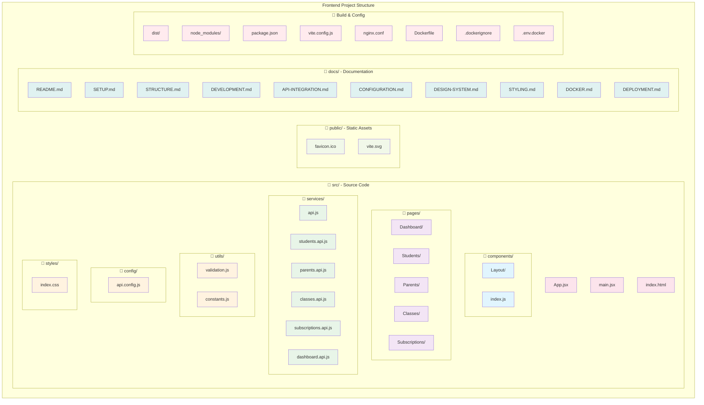
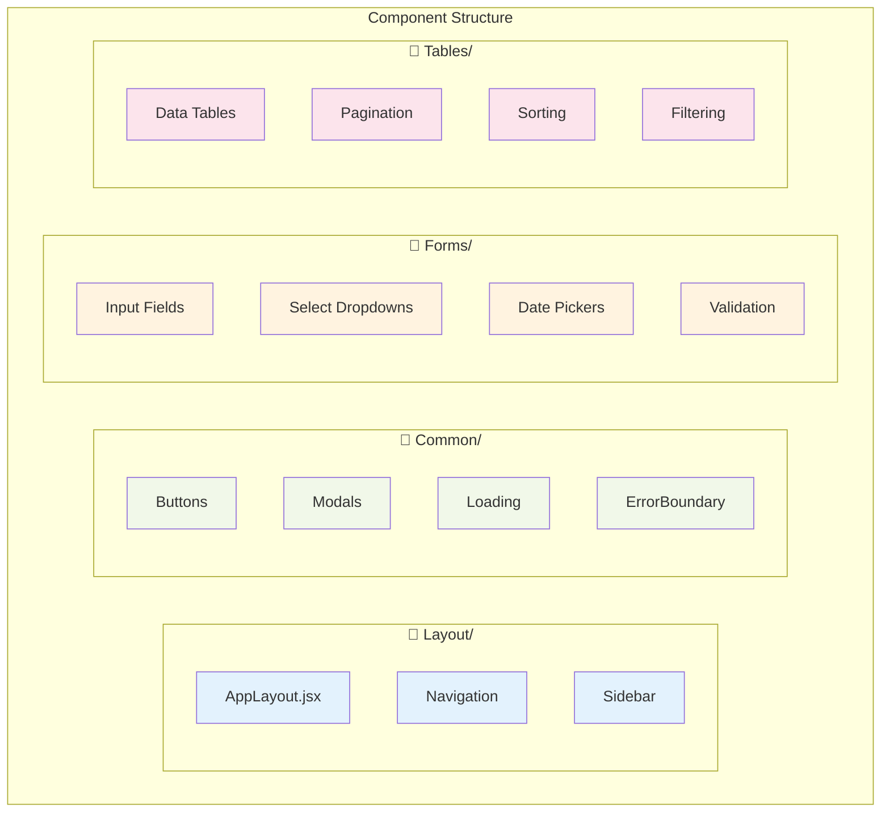
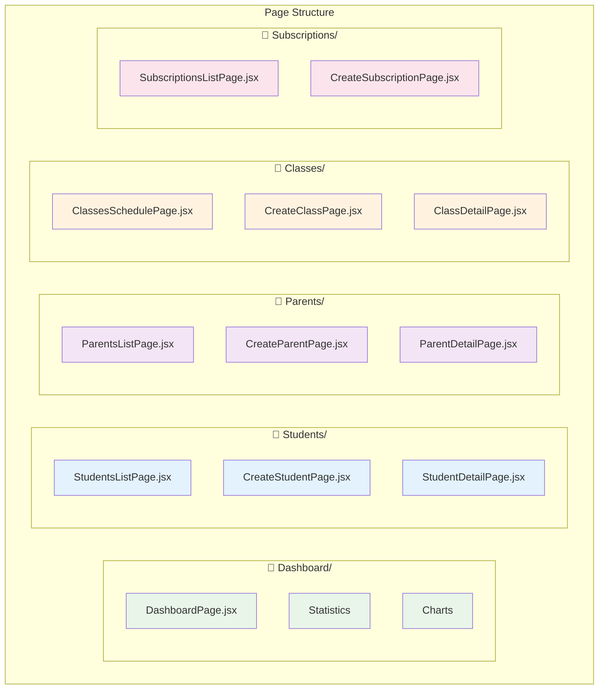
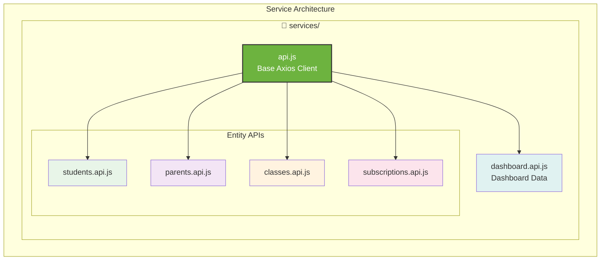
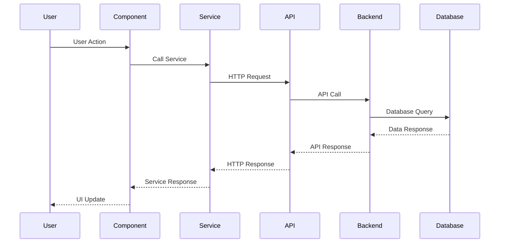
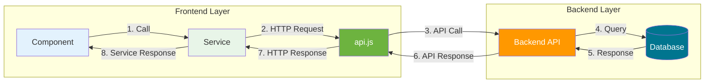
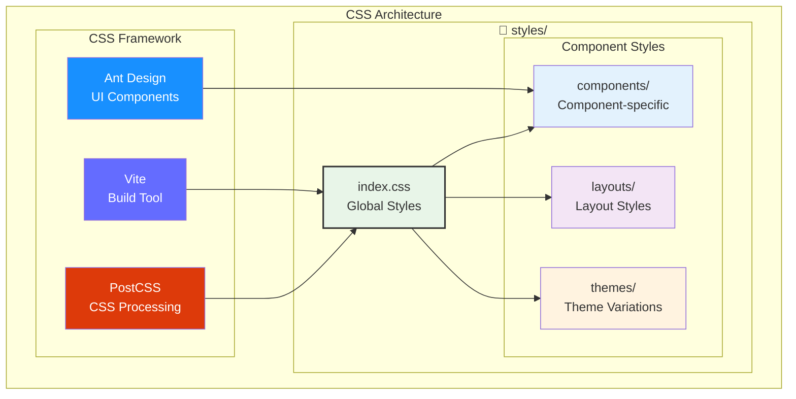

# 🏗️ Project Structure

Cấu trúc thư mục và files của **React Frontend** TeenUp Contest Management System.

## **📁 Cấu trúc thư mục**



## **🔧 Key Files**

### **📄 Configuration Files:**
- **`vite.config.js`** - Vite build tool configuration
- **`package.json`** - Dependencies và scripts
- **`api.config.js`** - API configuration cho các môi trường
- **`nginx.conf`** - Nginx configuration cho Docker

### **📄 Entry Points:**
- **`main.jsx`** - React app entry point
- **`App.jsx`** - Main app component với routing
- **`index.html`** - HTML template

### **📄 Core Components:**
- **`AppLayout.jsx`** - Main layout với navigation menu
- **`DashboardPage.jsx`** - Dashboard chính
- **`StudentsListPage.jsx`** - Danh sách học sinh
- **`ClassesSchedulePage.jsx`** - Lịch học tuần

## **🏗️ Architecture Patterns**

### **📁 Component Organization:**


### **📁 Page Organization:**


### **📁 Service Organization:**


## **🔌 Data Flow**

### **📊 State Management:**


### **📡 API Integration:**


## **🎨 Styling Architecture**

### **📁 CSS Organization:**


### **🎯 CSS Framework:**
- **Ant Design** - UI component library
- **Tailwind CSS** - Utility-first CSS framework
- **Custom CSS** - Component-specific styling

## **📱 Responsive Design**

### **📐 Breakpoints:**
- **Mobile:** < 768px
- **Tablet:** 768px - 1024px
- **Desktop:** > 1024px

### **🔧 Responsive Features:**
- **Flexible layouts** với Ant Design Grid
- **Mobile-first** approach
- **Touch-friendly** interactions

## **🔒 Security & Best Practices**

### **🛡️ Security Measures:**
- **Input validation** trong forms
- **XSS prevention** với React
- **CORS handling** qua Vite proxy

### **📝 Code Quality:**
- **ESLint** configuration
- **Component composition** patterns
- **Service layer** abstraction
- **Error handling** strategies

## **🚀 Build & Deployment**

### **📦 Build Process:**
```
Source Code → Vite Build → Optimized Bundle → Nginx Serve
```

### **🐳 Docker Support:**
- **Multi-stage build** (Node.js + Nginx)
- **Production optimization**
- **Environment configuration**

---

## **🔗 Related Documentation**

- 📖 **[Setup Guide](SETUP.md)** - Cài đặt và chạy
- 🚀 **[Development Guide](DEVELOPMENT.md)** - Phát triển
- 🔌 **[API Integration](API-INTEGRATION.md)** - Kết nối backend
- 🎨 **[Design System](DESIGN-SYSTEM.md)** - UI/UX guidelines
